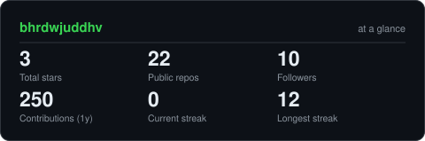
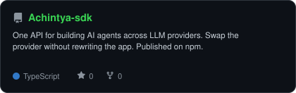
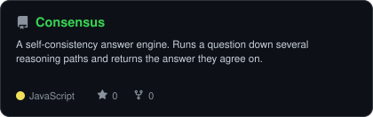
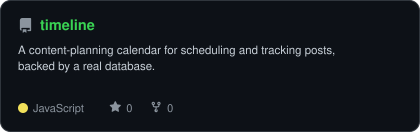
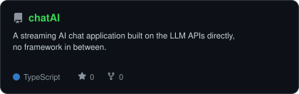

<!-- PORTRAIT - regenerate with:
       python scripts/dotify.py me.png -o assets/portrait --cols 100 --equalize --detail 0.5 --color
     --color bakes the photo's own colours into the dots, so one file serves both
     GitHub themes and no <picture> block is needed here. -->

 

 

<!--  -->

---

## 🧭 What I'm about

I'm a full-stack developer. I work mostly with React, Node.js, and MongoDB, and I've been moving more of my code over to TypeScript. Most of what I build lately puts AI to work inside real web apps — chat apps, answer engines, and an open-source SDK for building AI agents.

- Currently building **[Achintya SDK](https://github.com/bhrdwjuddhv/Achintya-sdk)**
- Learning **Data Structure and Algorithms**
- Fun fact: **k**

 

## 🛠️ Tech Stack

---

## 📊 Skills, rated two ways

<table>
<tr>
<td width="50%" align="center" valign="middle">

<!-- Self-rated — edit assets/skills.json, the workflow redraws it -->
<picture>
  <source media="(prefers-color-scheme: dark)"  srcset="assets/radar-dark.svg">
  <source media="(prefers-color-scheme: light)" srcset="assets/radar-light.svg">
  
</picture>

</td>
<td width="50%" align="center" valign="middle">

<!-- Live — real language byte counts across public repos. Edits itself. -->
<picture>
  <source media="(prefers-color-scheme: dark)"  srcset="assets/radar-langs-dark.svg">
  <source media="(prefers-color-scheme: light)" srcset="assets/radar-langs-light.svg">
  
</picture>

</td>
</tr>
<tr>
<td align="center">what I think</td>
<td align="center">what the bytes say</td>
</tr>
</table>

---

## 📅 A year of commits

<!-- 3D isometric calendar — .github/workflows/metrics.yml, every 6h. Needs METRICS_TOKEN. -->

  

<!-- Snake — .github/workflows/snake.yml, every 12h. 404s until its first run finishes. -->
<picture>
  <source media="(prefers-color-scheme: dark)"  srcset="https://raw.githubusercontent.com/bhrdwjuddhv/bhrdwjuddhv/output/snake-dark.svg">
  <source media="(prefers-color-scheme: light)" srcset="https://raw.githubusercontent.com/bhrdwjuddhv/bhrdwjuddhv/output/snake.svg">
  
</picture>

---

## 📈 The numbers

<!-- Generated by scripts/cards.py into this repo — deliberately not github-readme-stats
     or streak-stats, whose shared public instances 503 and take the section with them. -->
<picture>
  <source media="(prefers-color-scheme: dark)"  srcset="assets/card-stats-dark.svg">
  <source media="(prefers-color-scheme: light)" srcset="assets/card-stats-light.svg">
  
</picture>

 

  

---

## 📦 Selected Work

<!-- Cards from scripts/cards.py + assets/projects.json. Stars, forks and language
     are pulled live from the API each run. -->
<table>
<tr>
<td width="50%">
  <a href="https://github.com/bhrdwjuddhv/Achintya-sdk">
    <picture>
      <source media="(prefers-color-scheme: dark)"  srcset="assets/card-Achintya-sdk-dark.svg">
      <source media="(prefers-color-scheme: light)" srcset="assets/card-Achintya-sdk-light.svg">
      
    </picture>
  </a>
</td>
<td width="50%">
  <a href="https://github.com/bhrdwjuddhv/Consensus">
    <picture>
      <source media="(prefers-color-scheme: dark)"  srcset="assets/card-Consensus-dark.svg">
      <source media="(prefers-color-scheme: light)" srcset="assets/card-Consensus-light.svg">
      
    </picture>
  </a>
</td>
</tr>
<tr>
<td width="50%">
  <a href="https://github.com/bhrdwjuddhv/timeline">
    <picture>
      <source media="(prefers-color-scheme: dark)"  srcset="assets/card-timeline-dark.svg">
      <source media="(prefers-color-scheme: light)" srcset="assets/card-timeline-light.svg">
      
    </picture>
  </a>
</td>
<td width="50%">
  <a href="https://github.com/bhrdwjuddhv/chatAI">
    <picture>
      <source media="(prefers-color-scheme: dark)"  srcset="assets/card-chatAI-dark.svg">
      <source media="(prefers-color-scheme: light)" srcset="assets/card-chatAI-light.svg">
      
    </picture>
  </a>
</td>
</tr>
</table>

| project | what it does | stack |
|---|---|---|
| **[Achintya SDK](https://github.com/bhrdwjuddhv/Achintya-sdk)** | One API for AI agents across LLM providers. Swap providers without rewriting. On npm. | `TypeScript` |
| **[Consensus](https://github.com/bhrdwjuddhv/Consensus)** | Self-consistency answer engine — several reasoning paths, returns the one they agree on. | `JavaScript` |
| **[Timeline](https://github.com/bhrdwjuddhv/timeline)** | Content-planning calendar, real database behind it. | `JavaScript` `Appwrite` |
| **[chatAI](https://github.com/bhrdwjuddhv/chatAI)** | Streaming AI chat app, straight on the LLM APIs. | `TypeScript` |

More in my [repositories](https://github.com/bhrdwjuddhv?tab=repositories).

---

<b>Open to collaborating on AI-integrated products.</b> 
Reach me on <a href="https://www.linkedin.com/in/bhrdwjuddhv/">LinkedIn</a>.

